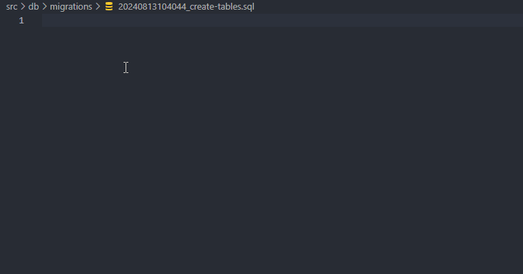

TypeSQL doesn't provide a tool to manage database migrations, you can use any tool for that. Two suggestions that works very well with raw SQL are [dbmate](https://github.com/amacneil/dbmate) and [geni](https://github.com/emilpriver/geni).

If you prefer to write migrations using raw sql (as I do), you can use the vscode extension **TypeSQL Language Server** to have a better developer experience. It provides auto-complete suggestions for raw SQL statements.

Creating schema with raw sql and a good autocomplete is a joy. See a demo below:

PS: The vscode extension is in a very early stage and works only for sqlite.
