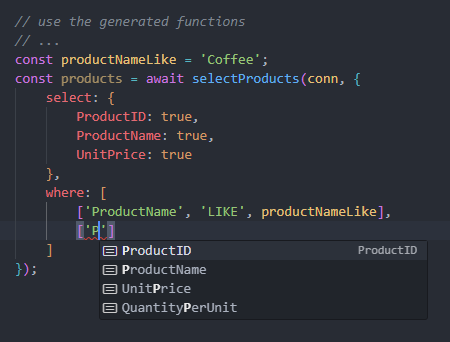

## Dynamic queries (`-- @dynamicQuery annotation`)

When you add the annotation `-- @dynamicQuery` in the SQL, the generated function will have parameters to pass **where conditions** and **select columns** dynamically. TypeSQL will build the final SQL based on the query parameters and will include only the necessary JOINS, CTEs and SELECT columns.

See the SQL below:

```sql
-- @dynamicQuery
SELECT
    *
FROM Products
```

### Select columns

Now you can choose which columns you want to select:

```ts
const products = await selectProducts(conn, {
  select: {
    CategoryID: true,
    ProductName: true,
    UnitPrice: true,
  },
});
```

If you run without the select parameter, it will return all the columns:

```ts
const products = await selectProducts(conn);
```

### Add filters dynamically

You can also add filter dynamically:

```ts
const productNameLike = "Coffee";
const products = await selectProducts(conn, {
  select: {
    ProductID: true,
    ProductName: true,
    UnitPrice: true,
  },
  where: [["ProductName", "LIKE", productNameLike]],
});
```

TypeSQL will build the SQL dynamically. For this query the built SQL will be:

```sql
SELECT
    p.ProductID,
    p.ProductName,
    p.UnitPrice
FROM Products p
WHERE 1 = 1
AND p.ProductName LIKE concat('%', ?, '%')
```

You can choose any column to filter in a type-safe way:


